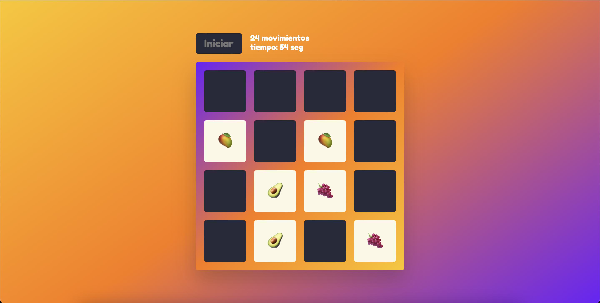

# Juego de Memoria 🧠

Este es un juego de memoria en el que debes encontrar pares de cartas que coincidan. El objetivo es hacer coincidir todas las cartas en el menor número de movimientos y tiempo posible.


## Características

- Interfaz amigable y colorida.
- Estadísticas en tiempo real que muestran el número de movimientos y el tiempo transcurrido.
- Animaciones suaves para mejorar la experiencia del usuario.
- Tablero de juego con dimensiones configurables.


### Capturas de Pantalla

Aquí tienes algunas capturas de pantalla del juego en acción:




## Enlace a la Demo

Puedes probar el juego en el siguiente enlace: [Demo del Juego de Memoria](https://estip13.github.io/memory-game/)


## Instalación

1. **Clona el repositorio**:
   ```bash
   git clone https://github.com/tu-usuario/tu-repositorio.git

2. **Navega a la carpeta del proyecto:
   ```bash
   cd nombre-del-repositorio

3. **Abre el archivo index.html en tu navegador para jugar.


## Juego

1. Haz clic en el botón "Iniciar" para comenzar el juego.
2. Haz clic en las cartas para voltear y encontrar pares.
3. El juego se completará cuando todas las cartas sean emparejadas.
